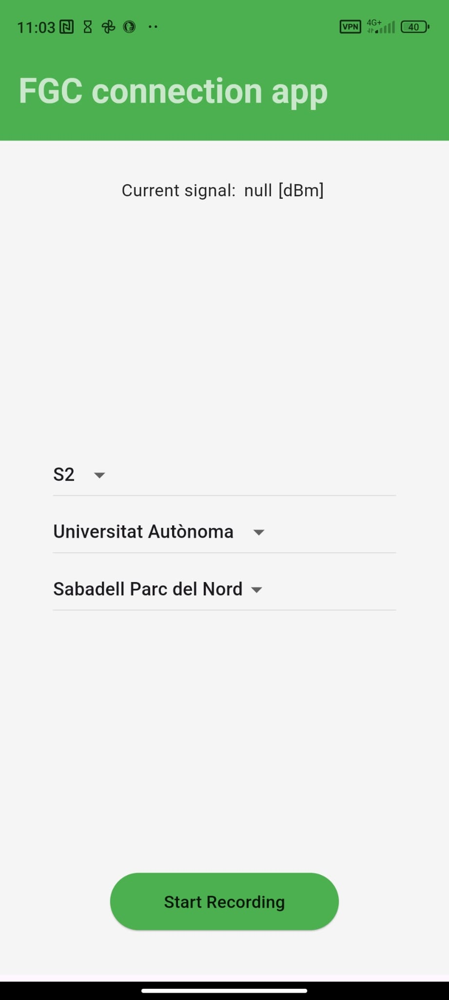
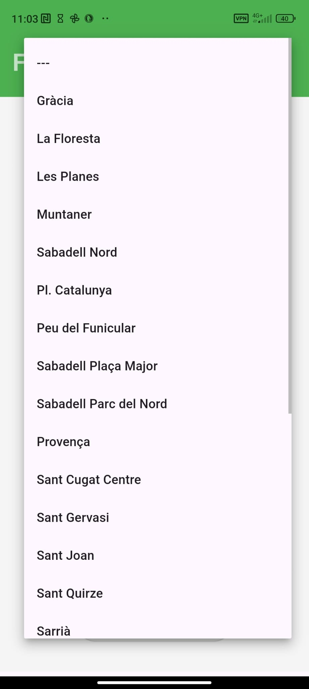
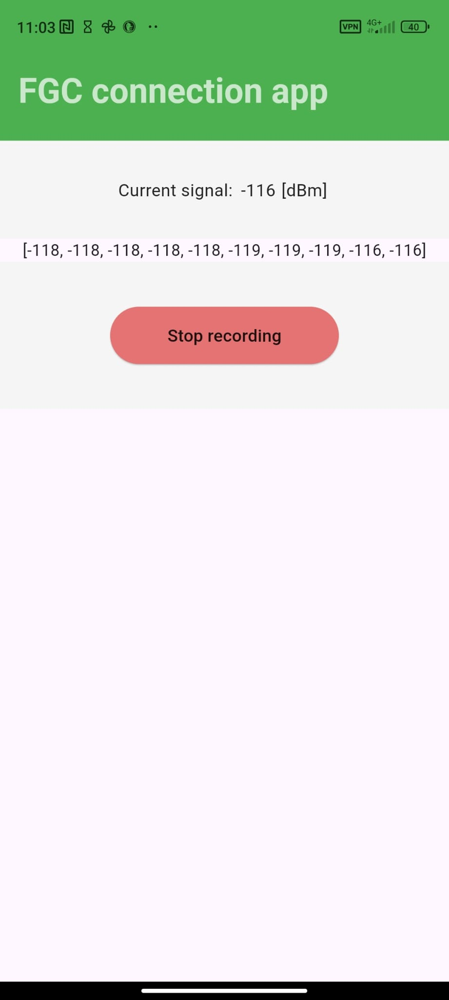
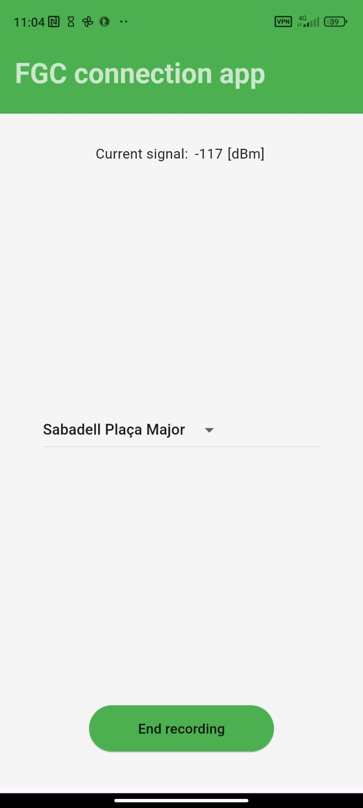

# FGC connectivity APP

In this project we (<a href="https://github.com/GeriiGarcia">GeriiGarcia</a>, <a href="https://github.com/Morgan1420">Morgan1420</a> and <a href="https://github.com/mariolcv">mariolcv</a>) have made an application that records and stores the <a href="https://en.wikipedia.org/wiki/Reference_Signal_Received_Power">RSRP metric</a> for a certain range of stations.

This repository, combined with the <a href="https://github.com/mariolcv/parsing-jsons-fgc-connectivity">parsing-jsons-fgc-connectivity repositoty</a> were made with a bigger idea on our minds. This idea was to present a study regarding the connecitvity issues of the FGC lines, with the aim to improve the connection and inclusivity of the FGC to the people who use their transport options to commute every day. The study proposal itself was presented to the FGC committee at the "Hack the UAB" hackathon.  

Going back to this repository, here we heve a couple of images of the APP in acction.

|   |   |   |   |
|---|---|

The app works as following:

1. Before entering a train we select: the line, the station we are geting onboard at and the direction of the line. The inputs must be in that order.
2. When onboard the train we hit the srtart recording button that will record all the RSRP data each second and store it on a JSON file.
3. When we get off the train we hit the stop recording button, that will stop all the uploads to the JSON.
4. Utimatly we select the station we got of the train and hit end.

This is a simple procedure and we can repeat as many times we want. 

The JSON files will be stored localy (do not worry, the files are not that heavy) and then we must recover them directly connecting the phone to a computer. We didn't have enougth  time in the 24h margin to implement a propper backend.

After weading the JSONs on a computer we proceed with the data reading at the <a href="https://github.com/mariolcv/parsing-jsons-fgc-connectivity">parsing-jsons-fgc-connectivity repositoty</a>.
