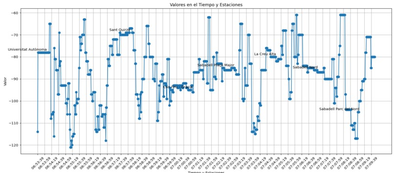
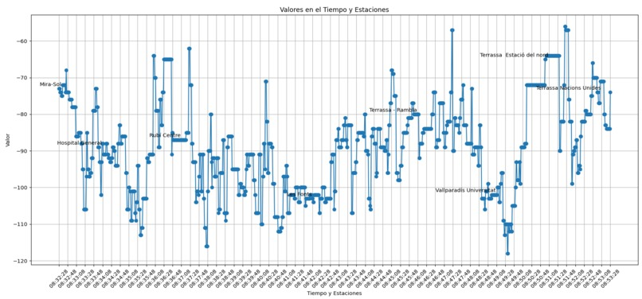

# FGC connectivity APP

In this project we (<a href="https://github.com/GeriiGarcia">GeriiGarcia</a>, <a href="https://github.com/Morgan1420">Morgan1420</a> and <a href="https://github.com/mariolcv">mariolcv</a>) have made an application that records and stores the <a href="https://en.wikipedia.org/wiki/Reference_Signal_Received_Power">RSRP metric</a> for a certain range of stations.

This repository, combined with the <a href="https://github.com/mariolcv/parsing-jsons-fgc-connectivity">parsing-jsons-fgc-connectivity repositoty</a> were made with a bigger idea on our minds. This idea was to present a study regarding the connecitvity issues of the FGC lines, with the aim to improve the connection and inclusivity of the FGC to the people who use their transport options to commute every day. The study proposal itself was presented to the FGC committee at the "Hack the UAB" hackathon.  

Going back to this repository, here we heve a couple of images of the APP in acction.

|   |   |   |   |
|---|---|---|-|

The app works as following:

1. Before entering a train we select: the line, the station we are geting onboard at and the direction of the line. The inputs must be in that order.
2. When onboard the train we hit the srtart recording button that will record all the RSRP data each second and store it on a JSON file.
3. When we get off the train we hit the stop recording button, that will stop all the uploads to the JSON.
4. Utimatly we select the station we got of the train and hit end.

This is a simple procedure and we can repeat as many times we want. 

The JSON files will be stored localy (do not worry, the files are not that heavy) and then we must recover them directly connecting the phone to a computer. We didn't have enougth  time in the 24h margin to implement a propper backend.

After weading the JSONs on a computer we proceed with the data reading at the <a href="https://github.com/mariolcv/parsing-jsons-fgc-connectivity">parsing-jsons-fgc-connectivity repositoty</a>.

## Inspiration
As daily users of railway services in Catalonia, we have experienced a real problem that affects a large number of people, especially students like us. For this reason, we believe that knowing in advance the internet connectivity limitations we will experience during our journeys would be very useful.

## What It Does
We created an Android prototype app that records the signal strength received on the phone. The data is stored in JSON structures, and we use Python plots to visualize the data. Additionally, we conducted a small test study to verify the app’s functionalities. 

|    |   |  
|---|---|

## How We Built It
We organized the work into two GitHub repositories. One repository is dedicated to the app, which we built using Flutter and Dart. The app also locally hosts the static data of the FGC (Ferrocarrils de la Generalitat de Catalunya) schedules, which we obtained from the GTFS real-time and schedule API. The data is structured in JSON files, and we use a Python script with the `plotlib` library to visualize it.

## Challenges We Ran Into
We faced challenges when merging each other's progress, as well as in using Flutter, since it was our first time working with this framework.

## Accomplishments That We're Proud Of
We are proud to have successfully implemented the idea we had from the beginning without deviating from our main objective.

## What We Learned
We learned how to use Dart, Flutter, JSON files, and how to prototype an application.

## What's Next for FGC Connect
We could continue with the study, refine the results, and implement further updates to improve the app's performance and user experience.

## Built With
- Dart
- Flutter
- JSON
- Python